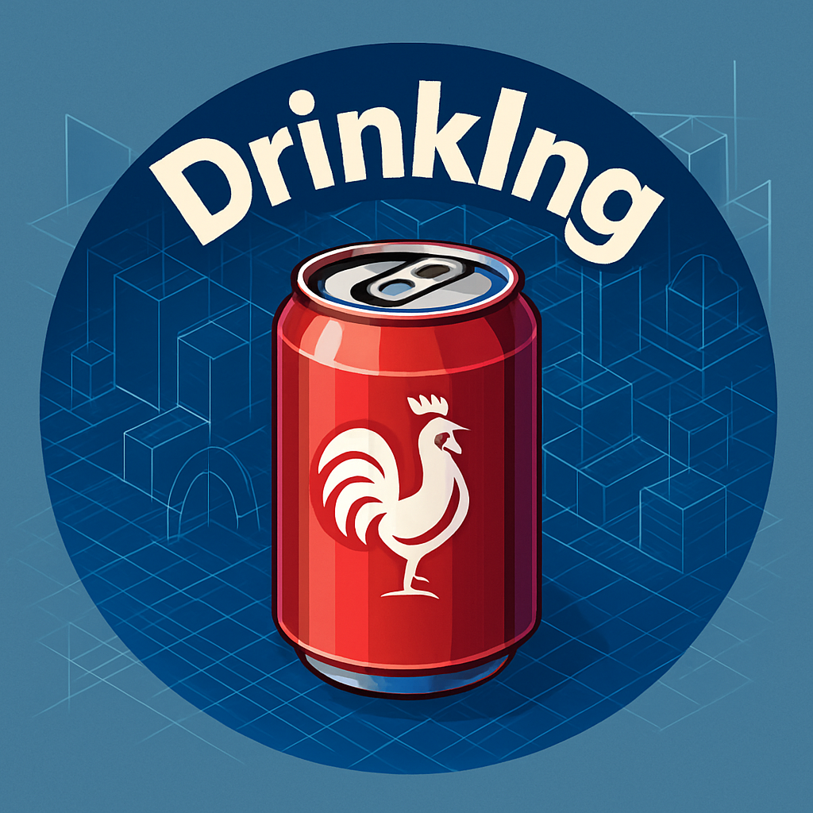
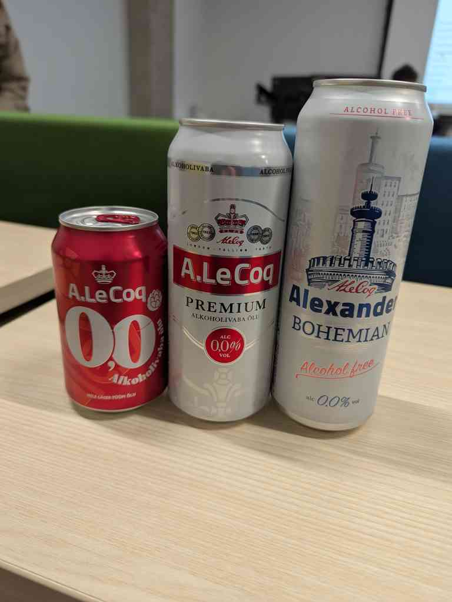
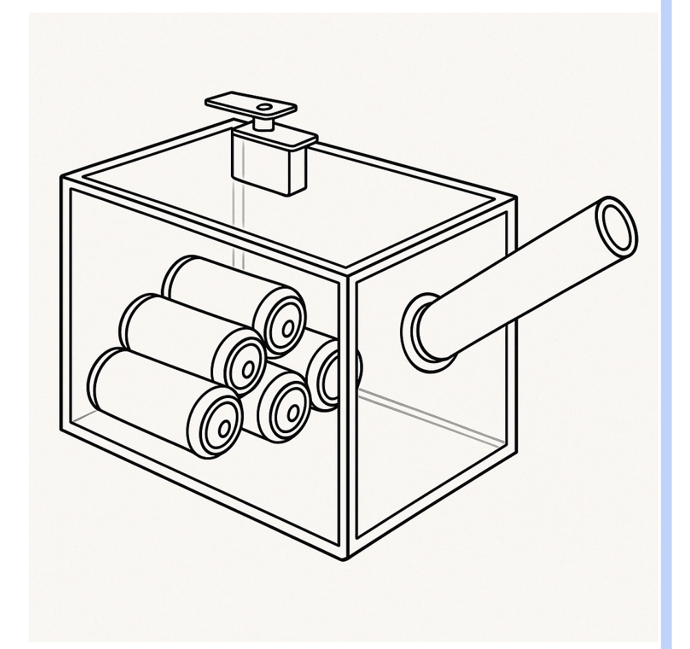

# DrinkIngineers - The Beer Cannon 

This project is part of the spring 2025 semester's IoT class of the University of Tartu. 
The team DrinkIngineers is composed of 4 team members : 
- [Nicolas](https://github.com/heurkenn)
- [Juan Gonzalo](https://github.com/JuanGQCadavid)
- [Martin](https://github.com/LogicLobster)
- [Cédric](https://github.com/Pl0uf-tlt)

The goal of this project is to build a beer cannon. We hope to be able to throw a cold beer can from a distance of a few meter on a push of a button.

## Potential sponsorship

We would love to be sponsored by A.Le Coq. Here is a picture of the cans we will be using for the test for the whole project : 

---

# Design

## Possible methods to throw a can 

### Air cannon

We thought of using compressed air to throw the beer out of a tube. One of the issues is that manipulating compressed air is difficult and the power consumption is pretty high. 

### Spring 

Using a spring to lauch the cans is feasible but the weight of the cans means we have to use really powerful spring that are expensive and to reload the mechanism we would have needed a system that would be to complicated. 

### Electromagnetic railgun 

This could heat the beer and the cans are in aluminium which isn't magnetic. 

### Trebuchet 

A trebuchet is feasible but it seemed impossible to reliably aim at the same spot. Also we weren't sure how to automatically load the cans into the trebuchet. 

### Slingshot 

Using rubber bands to lauch the cans seems to be the cheapest, easiest and most reliable idea we had. 

## The slingshot 

The goal is to have a cooler with beers in a row inside, the beers would slide into a slingshot to be launched into the air on the push of a button. 

---

# Material list

> - Motor 
> - Cooler 
> - PVC pipes 
> - Thermometer
> - LED matrix pannel
> - Microcontroler
> - Button 
> - Bike tyre inner tube 
> - String 
> - 

--- 

# Milestones 

## Part 1 - The attachement points for the rubber band

The goal of this first part is to design and test attachment points for the rubber bands. The rubber bands could be made out of bike tyres inner tube. 

### Why is this important ? 

This will probably be the most critical point of our system. In order to lauch a can a few meters into the air we must have powerful bands and the amount of force applied onto the attachment points would be pretty big. An issue here would lead to a project failure. 

### How we plan to do it ?

The lauch tube would be made out of PVC pipes and should be pretty solid on its own. We could use screws into the tube walls to attach the bands. 

## Part 2 - The trajectory

We have to reliably and precisly throw the cans. The goal of this part is to test the lauch mechanism to verify :
- Solidity of the attachment points
- Precision
- Reliability
- Power needed to throw

## Part 2.5 - The sponsorship 

At this point we should have a working manual prototype to present to A.Le Coq to ask for a sponsorship. The goal is 

## Part 3 - The reload mechanism

Until this point we would use a manual reload system with a ratchet or a crank. But here the goal is to use a motor (with a gear box if needed) to pull the rubber bands back and be able to load and throw a new can. 

## Part 4 - A hot beer cannon sucks

We need to cool the beer down. We haven't established how to do this yet but here are some ideas. We could use peltier modules to cool a bunch aof water in wich the beers would be standing. We could also just put some ice in some water and blow on it using a fan. The problem is that it would probably don't last a long time.

---

# Safety concerns 

